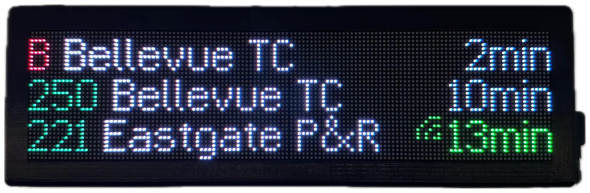

# Transit Tracker

  

This repository contains the firmware and documentation for Transit Tracker, an open-source DIY public transit arrivals board for your home.

Please see the complete documentation [here](https://eastsideurbanism.github.io/transit-tracker)!

## Related Projects

- [Transit Tracker API](https://github.com/tjhorner/transit-tracker-api) &mdash; the service which syndicates and streams schedule data to Transit Tracker devices
- [Transit Tracker ESPHome Component](https://github.com/tjhorner/esphome-transit-tracker) &mdash; the ESPHome custom component which powers the Transit Tracker firmware
