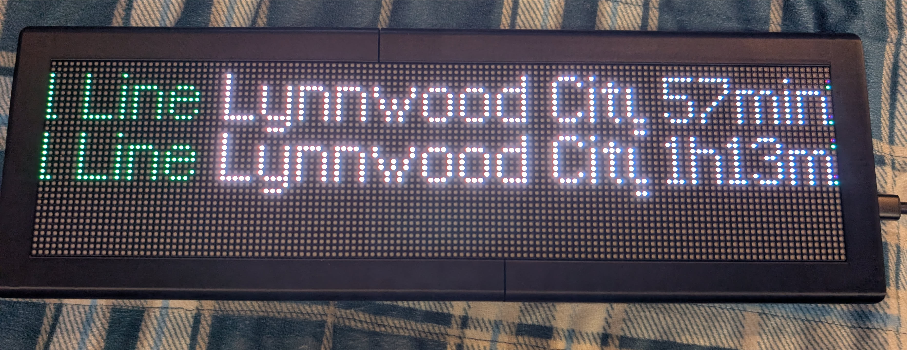
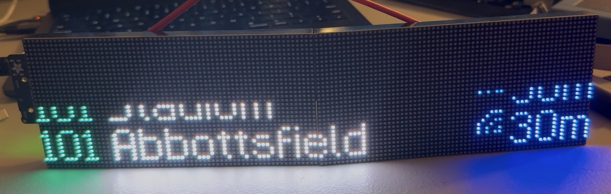

# Materials

:::info Disclaimer
The AliExpress links below are affiliate links, which means we get a cut of the sale at no cost to you. Any revenue received from these links goes towards hosting costs for our Transit Tracker API server; **we do not profit from them**. Thanks for your support!
:::

## Shopping List

To follow this build guide, you'll need the following parts:

| Qty | Item                            | Purchase                                                                                                                                                                                                                                                                                                  | Notes                                                |
| --- | ------------------------------- | --------------------------------------------------------------------------------------------------------------------------------------------------------------------------------------------------------------------------------------------------------------------------------------------------------- | ---------------------------------------------------- |
| 1   | Adafruit Matrix Portal S3       | [Adafruit](https://www.adafruit.com/product/5778) • [Mouser](https://www.mouser.com/ProductDetail/Adafruit/5778?qs=Imq1NPwxi76kMOX7JIfHcg%3D%3D) • [DigiKey](https://www.digikey.com/en/products/detail/adafruit-industries-llc/5778/21839792) • [AliExpress](https://s.click.aliexpress.com/e/_c4Odoef1) | The original Matrix Portal M4 is **not** supported   |
| 2   | Waveshare RGB-Matrix-P2.5-64x32 | [Waveshare](https://www.waveshare.com/rgb-matrix-p2.5-64x32.htm?sku=23707) • [Adafruit](https://www.adafruit.com/product/5036) • [AliExpress](https://s.click.aliexpress.com/e/_c2JPsqBp) • [Amazon](https://www.amazon.com/dp/B0BRBGHFKQ)                                                                                                                | See [note about displays](#note-about-displays)      |
| 12  | M3x8mm machine screws           | [McMaster](https://www.mcmaster.com/92005A118)                                                                                                                                                                                                                                                            | You can also find these at your local hardware store |
| 1   | USB power supply                | [Monoprice](https://www.monoprice.com/product?p_id=43130) • [Adafruit](https://www.adafruit.com/product/1994)                                                                                                                                                                                             | 5V/2A recommended                                    |
| 1   | USB-C cable                     | [Monoprice](https://www.monoprice.com/product?p_id=47671) • [Adafruit](https://www.adafruit.com/product/5031)                                                                                                                                                                                             | Preferably right-angle for wall mounting             |

You can buy most of these parts directly from Adafruit [using this wishlist](https://www.adafruit.com/wishlists/604463). Just press "Add All to Cart" at the bottom and check out! The only thing not included in the wishlist is the screws.

If you plan on 3D printing your own frame, a printer with at least a 30×115×210mm build volume is required. Otherwise, you may be able to find one at your local library or university, get the frame printed from a service online, or maybe a friend has one!

### Note about displays

There are many vendors that sell clones of the display panels used for this project, and while they may share the same form factor and even model number, they are frequently wired slightly differently or use cheaper components than the panels from Waveshare. Sometimes these differences may not matter, but in many cases they can cause strange artifacts, swapped color channels, or just not work at all. It's also usually not possible to catch these differences ahead of time, because the sellers don't typically list the required information.

Examples of issues with non-standard displays

<h3>Pixels are offset by one column</h3>

<h3>Color channels swapped, half of display is not working</h3>

It may be possible to mitigate issues with these non-standard displays, **but it will require a lot of trial and error and firmware recompilation.** This is why we recommend buying these panels directly from the sellers we've linked above; even if they are slightly more expensive, it will save you a lot of hassle.
