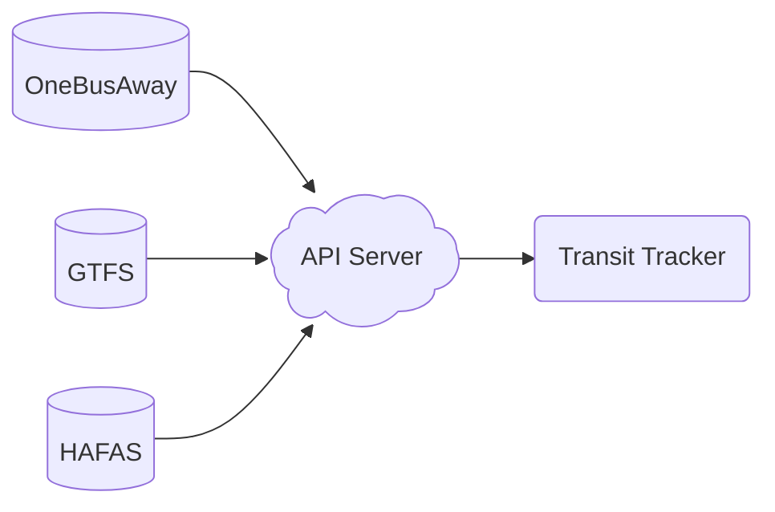

# API Server

The Transit Tracker API server is the service that powers delivery of schedule data to the Transit Tracker device. It connects to the data sources provided by transit agencies (e.g., GTFS or OneBusAway) and publishes schedule data in a more lightweight format. While intended to be used with Transit Tracker, you can also use it for anything that requires real-time schedule data for specific routes and stops.

Eastside Urbanism hosts the API server used throughout this guide, but anyone is welcome to host their own for personal use or to add support for additional transit agencies. More information on deployment can be found on the [GitHub repository](https://github.com/tjhorner/transit-tracker-api).

If you are familiar with Docker and Docker Compose, you can check out [this guide](https://github.com/tjhorner/transit-tracker-api/blob/main/docs/deployment/deploy-docker.md) for a quick deployment.

Once you have deployed your API server, you can swap to its URL in the configurator under the **Advanced** tab.

## Purpose

You might be wondering why the Transit Tracker device doesn't just connect directly to transit agencies' data sources. It would certainly simplify the architecture, eliminating the requirement for a dedicated API server. However, there are a few key reasons why this isn't feasible.

1. Agencies don't always provide data in a standard format. Each format would require a separate implementation in the Transit Tracker firmware.
2. Most transit data formats require considerable power and RAM to process and format properly. The ESP32-S3 that powers Transit Tracker would not be able to handle this.

Due to these issues, it's more practical to offload data fetching and processing to an external service which can then distill the necessary information into a lightweight format that can work on even the weakest devices. It also provides additional flexibility to easily add support for new data formats without firmware updates.

The vast majority of transit agencies provide their data in the [GTFS](https://gtfs.org/) format, but this is not universally true: some provide static data with GTFS but real-time data with a non-standard API, and others do not use GTFS at all. In some cases, it may even be preferable to use an agency's API instead of their GTFS feed since it reduces the amount of processing required.

With this in mind, the API service was built for easy extensibility. Different types of data sources are organized into "feed providers", and adding a new one is easy. If you are interested in implementing your own, see the [FeedProvider interface](https://github.com/tjhorner/transit-tracker-api/blob/main/src/modules/feed/interfaces/feed-provider.interface.ts) and the [OneBusAway implementation](https://github.com/tjhorner/transit-tracker-api/tree/main/src/modules/feed/modules/one-bus-away) as reference.
